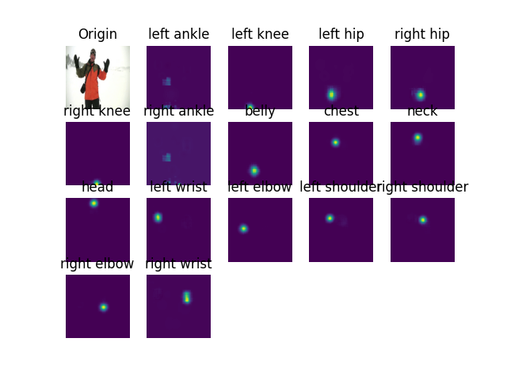
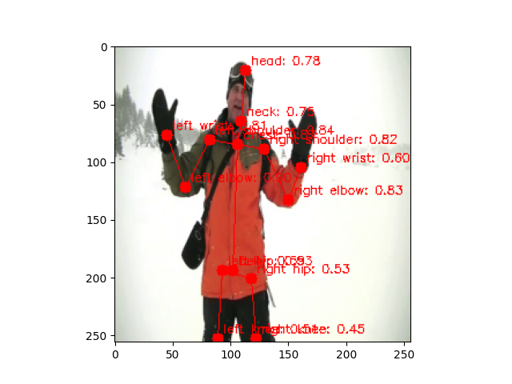
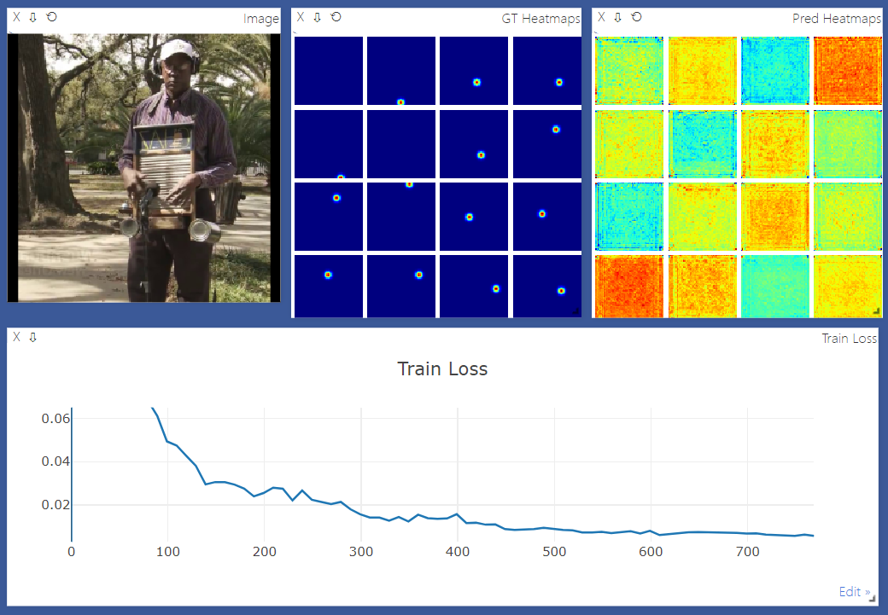

# pose-estimation

基于pytorch的姿态估计，当前实现的模型有：

- Hourglass (Stack2)
- Simple Baselines (ResNet50)
- HRNet

支持上述所有模型的训练、测试和摄像头测试。

默认使用MPII数据集进行训练，对人体的16个关键点进行估计。

在train.py等文件中，修改参数`use_model`,可替换要训练/测试的模型。

## 效果展示

使用HRNet官方的pose_hrnet_w32_256x256.pth模型，效果如下：





## 使用说明

- train.py 训练脚本
- test.py 测试脚本，显示单张图片各关键点的heatmap、位置和连接线
- live_demo.py 摄像头脚本，显示摄像头中人物各关键点的位置和连接线，请确保你的电脑拥有摄像头

### 训练

train.py依赖于CUDA，请在CUDA环境下使用！test.py和live_demo.py可在CPU环境下使用。

如果要进行训练，请在data目录下放置所需的MPII数据集文件

```
data
├── mpii_human_pose_v1
│   ├── images
│   │   ├── 000001163.jpg
│   │   ├── 000003072.jpg
│   │   ├── 000004812.jpg
│   │   ├── 099987144.jpg
│   │   ├── 099990098.jpg
│   │   └── ...
│   └── mpii_annotations.json
```

如上所示，在data目录中创建名为mpii_human_pose_v1的目录，将MPII官方数据集解压后的images文件夹放入其中，并下载[mpii_annotations.json](https://drive.google.com/file/d/1mQrH_yVHeB93rzCfyq5kC9ZYTwZeMsMm/view)放入其中。

之后创建weights目录供模型文件的存放。

train.py训练脚本中有一些超参数可供设置：
```python
seed = 999
use_model = 'HRNet' # 可选：Hourglass_Stack2, ResNet, HRNet
lr = 1e-3 # 学习率
bs = 12 # Batch Size
n_epoches = 20 # 总共的训练次数
ckpt = None # 历史模型文件，设为None将重新训练，否则将读取已有的模型文件，请确保模型文件与use_model选择的模型一致！
```

之后启动Visdom(如果已经安装的话)：
```shell
python -m visdom.server
```

最后运行训练脚本：
```shell
python train.py
```
可访问[Visdom](http://localhost:8097)查看训练过程：


### 使用预训练模型测试

*预训练模型有待补充，可在各模型的官方文档下载对应的预训练模型，对脚本稍加修改后即可使用*

*例如，对于HRNet官方提供的模型：[pose_hrnet_w32_256x256.pth](https://drive.google.com/open?id=1_wn2ifmoQprBrFvUCDedjPON4Y6jsN-v)，可对脚本做如下修改：*

修改前：
```python
use_model = 'HRNet' # 可选：Hourglass_Stack2, ResNet, HRNet
ckpt = '' # 模型文件
model.load_state_dict(torch.load(ckpt)['model'])
```

修改后：
```python
use_model = 'HRNet' # 可选：Hourglass_Stack2, ResNet, HRNet
ckpt = 'weights/pose_hrnet_w32_256x256.pth' # 模型文件
model.load_state_dict(torch.load(ckpt))
```

*在去除`['model']`后，官方的模型文件就可以使用了*